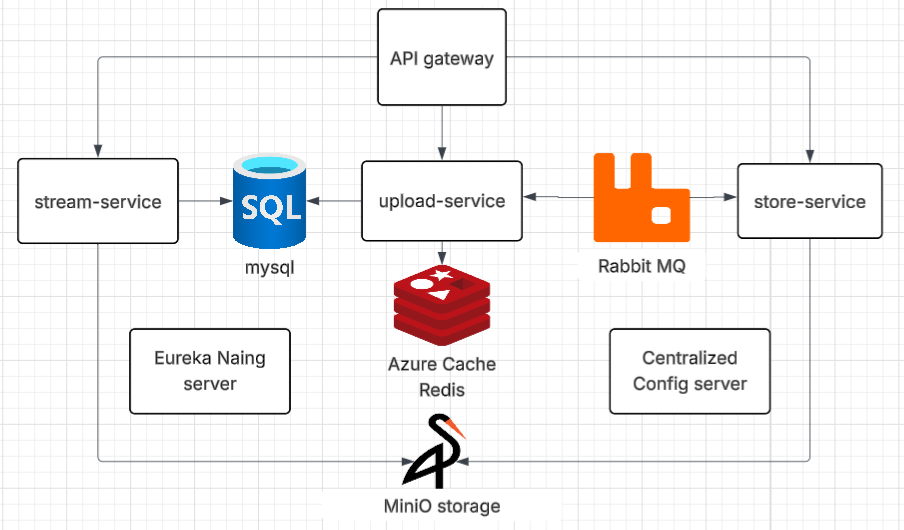

# MediaHub Video Upload and Streaming Platform

This project is a simplified but **real-world-inspired** implementation of a video platform backend like YouTube, built primarily for **learning purposes**. It demonstrates video upload via chunking, processing using FFmpeg, storage using MinIO (object storage), and HLS-based streaming.

---

## 🧠 Project Goals

- Understand video upload workflows
- Learn distributed file handling via chunking
- Practice FFmpeg processing for resolution variants
- Store and serve content using **object storage** (MinIO)
- Generate HLS content with `master.m3u8` and `playlist.m3u8`
- Serve the content securely and efficiently for streaming

---

### 📊 System Architecture Diagram



---

### 🧱 Components

#### 🧩 Microservices

- **API Gateway**  
  - Single entry point for client requests  
  - Handles routing to appropriate services  
  - Uses Spring Cloud Gateway

- **Upload Service**  
  - Handles chunked video uploads  
  - Stores each chunk temporarily in MinIO  
  - Sends a message to RabbitMQ when upload completes

- **Store Service**  
  - Listens for upload events from RabbitMQ  
  - Merges video chunks  
  - Uses FFmpeg to generate HLS (.m3u8 + .ts)  
  - Uploads final segments back to MinIO

- **Stream Service**  
  - Serves HLS playlists and segments  
  - Handles secure playback via signed URLs  
  - Uses MinIO as object storage backend

#### 🗃️ Shared Infrastructure

- **MySQL**  
  - Stores metadata for videos and upload sessions

- **MinIO Storage**  
  - Stores chunked videos and final HLS segments  
  - Acts as an S3-compatible object store

- **RabbitMQ**  
  - Decouples `upload-service` and `store-service`  
  - Used for asynchronous event-driven communication

- **Redis (Azure Cache)**  
  - Caches frequently accessed data  
  - Can store temporary auth tokens or signed URLs

#### 🧭 Support Services

- **Eureka Naming Server**  
  - Service discovery and load balancing  
  - All services register themselves here

- **Centralized Config Server**  
  - Provides environment-based configuration  
  - Makes it easy to manage properties across services

---

## 🗃️ MinIO Storage Structure

```
mediahub-videos/
├── uploads/
│   └── {upload-id}/tmp/chunk_0, chunk_1, ...
└── stream-folder-storage/
    └── {video-id}/
        ├── master.m3u8
        ├── 144/
        │   ├── playlist.m3u8
        │   └── segment1.ts, segment2.ts ...
        ├── 240/
        ├── 360/
        ├── 480/
        ├── 720/
        └── 1080/
```

> The original `.mp4` is not uploaded to save space. Only HLS files are served.
---

### 📦 Features

- ✅ Chunked video uploading
- ✅ HLS transcoding with FFmpeg
- ✅ Microservices-based modular architecture
- ✅ Scalable object storage with MinIO
- ✅ Video streaming via HLS
- ✅ Service discovery and config management
- ✅ Message-driven processing with RabbitMQ
- ✅ Distributed caching with Redis

---

### ⚙️ Technologies Used

- Java + Spring Boot
- Spring Cloud Gateway, Eureka, Config Server
- MySQL
- MinIO (S3-Compatible)
- RabbitMQ
- Redis
- FFmpeg
## 🚀 How to Run Locally (Dev Setup)

### ✅ Prerequisites
- Java 17+
- Maven
- Docker & Docker Compose (for MinIO & RabbitMQ)
- FFmpeg installed and accessible in your PATH

### 🔧 Start Services
1. **Start RabbitMQ and MinIO using Docker Compose**:
```bash
docker-compose -f docker-compose.dev.yml up
```

2. **Make MinIO bucket public (for dev streaming)**:
```bash
mc alias set local http://localhost:9000 minioadmin minioadmin
mc policy set public local/mediahub-videos
```

3. **Run Upload Service**
```bash
cd upload-service
mvn spring-boot:run
```

4. **Run Store Service**
```bash
cd store-service
mvn spring-boot:run
```

---

## 🔐 Production Considerations

In real-world deployments:

- Use **CDN + Authentication Proxy** in front of MinIO
- Serve content via signed URLs
- Use different buckets for uploads vs. stream storage if needed
- Store original videos in cold storage if required
- Add retry policies and error handling on queue consumers

---

## 📺 Example HLS Integration

```js
const hls = new Hls();
hls.loadSource("https://cdn.example.com/stream-folder-storage/{video-id}/master.m3u8");
hls.attachMedia(videoElement);
```

> Ensure all `playlist.m3u8` and `.ts` segment URLs inside `master.m3u8` are relative.

---

## 📂 Multi-Version Code

This repo has two main implementations:

- `/disk-version` — older version using file system only
- `/object-storage-version` — current version using MinIO


---

## 👨‍💻 Author

**Ahmed Ramadan** — For educational purposes, built with passion for learning distributed systems, video processing, and backend architecture.

---

## ⭐ Acknowledgements

- YouTube for inspiration
- FFmpeg project
- MinIO community
- Spring Boot ecosystem


